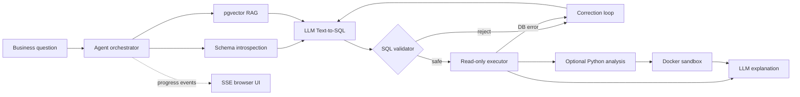
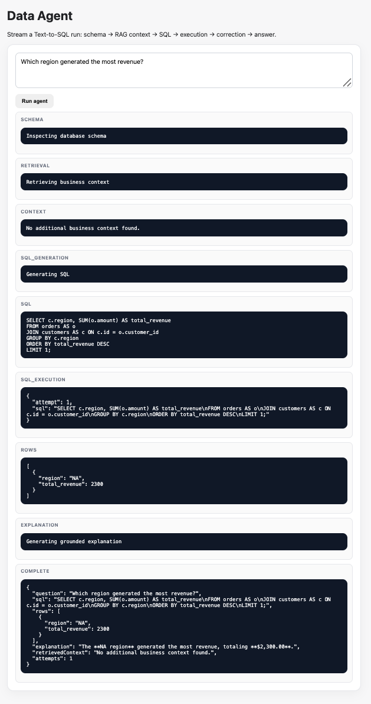

# Data Agent

**Ask a business question in natural language. Get guarded SQL, traceable execution, and an explainable answer.**

An end-to-end analytics agent built with **Java 21, Spring Boot, PostgreSQL, pgvector, LLMs and Docker**. The project focuses on a practical problem with Text-to-SQL systems: model output is useful only when business context, execution safety, failure recovery and evaluation are designed around it.

> Original implementation inspired by common Data Agent architecture patterns. No third-party tutorial source code is copied into this repository.

## Why this project exists

A naive Text-to-SQL demo can generate a query, but a production-oriented analytics agent has harder problems:

| Problem | Design response |
| --- | --- |
| The model does not know company-specific definitions | Retrieve business context with pgvector RAG before SQL generation |
| Generated SQL can be invalid | Feed execution errors back into a bounded SQL repair loop |
| Generated SQL can be unsafe | Validate queries and execute them inside a read-only transaction with a timeout |
| Complex analysis may need code | Run generated Python inside a resource-constrained, network-disabled Docker sandbox |
| Agent behavior is hard to debug | Stream intermediate stages to the browser with SSE |
| LLM output is hard to regression-test | Keep deterministic SQL safety/structure evaluation in CI |

## Architecture



**Core pipeline**

`Question → Schema + RAG → SQL → Validation → Read-only execution → Repair if needed → Optional Python analysis → Explanation`

## What is implemented

- **Text-to-SQL agent** — schema-aware natural-language query generation.
- **Business-context RAG** — PostgreSQL + pgvector retrieval for definitions and rules.
- **Defense in depth for SQL** — SELECT/CTE validation, one-statement policy, forbidden write/DDL keywords, read-only transaction and statement timeout.
- **Error-driven self-correction** — failed SQL can be regenerated with the database/validation error as feedback.
- **Isolated Python analysis** — generated code runs in a temporary Docker container with no network, read-only filesystem, dropped capabilities, CPU/memory/PID limits and timeout.
- **Observable execution** — SSE exposes schema, retrieval, SQL generation, execution, repair and answer stages in the browser.
- **Evaluation + CI** — reusable SQL evaluation cases and GitHub Actions tests without requiring paid LLM calls.
- **Reproducible packaging** — PostgreSQL/pgvector Compose environment plus a multi-stage, non-root application Docker image.

## Demo

A successful end-to-end run showing schema inspection, business-context retrieval, SQL generation, guarded execution, result retrieval and grounded explanation.



Example question:

```text
Which region generated the most revenue?
```

The UI exposes the execution path instead of hiding the agent behind a loading spinner:

```text
schema
  ↓
retrieval / business context
  ↓
SQL generation
  ↓
validation + read-only execution
  ↓
repair (only when needed)
  ↓
rows + explanation
```

For a deeper path, try:

```text
Compare revenue concentration across regions and summarize the pattern.
```

See [`docs/DEMO.md`](docs/DEMO.md) for the 90-second walkthrough and interview framing.

## Quick start

**Requirements:** Java 21, Maven and Docker.

```bash
docker compose up -d
export LLM_API_KEY='your-key'
mvn spring-boot:run
```

Then open `http://localhost:9933/`.

Optional configuration is documented in [`.env.example`](.env.example).

### API

```bash
# Standard Text-to-SQL flow
curl -X POST http://localhost:9933/api/agent/ask \
  -H 'Content-Type: application/json' \
  -d '{"question":"Which region generated the most revenue?"}'

# Stream execution stages
curl -N 'http://localhost:9933/api/agent/stream?question=Which%20region%20generated%20the%20most%20revenue%3F'

# SQL + isolated Python analysis
curl -X POST http://localhost:9933/api/agent/analyze \
  -H 'Content-Type: application/json' \
  -d '{"question":"Compare revenue concentration across regions and summarize the pattern."}'
```

## Safety boundaries

The LLM is a **proposal layer**, not a trusted execution environment. SQL is placed behind deterministic validation and database read-only controls. Python is not executed inside the JVM or directly on the host: the analysis service creates a constrained Docker container with networking disabled and explicit resource limits.

These controls reduce risk; they are not presented as a complete production security boundary. A real multi-tenant deployment would additionally require authentication, authorization, tenant-specific database permissions, rate limiting, audit logs and managed secrets.

## Evaluation

Run the deterministic test suite:

```bash
mvn test
```

Reusable cases live in `src/test/resources/eval/cases.json`. They check expected tables/SQL structures and forbidden operations without making live LLM calls, which makes regression checks cheap enough for every pull request.

## Tech stack

| Layer | Technology |
| --- | --- |
| Backend | Java 21, Spring Boot 3 |
| Database | PostgreSQL |
| Retrieval | pgvector + embeddings |
| AI | OpenAI-compatible LLM / embedding clients |
| Analysis | Isolated Python 3.12 Docker sandbox |
| Streaming | Server-Sent Events |
| Testing | JUnit, Mockito, deterministic SQL evaluation |
| Delivery | Docker, Docker Compose, GitHub Actions |

## Engineering progression

`M1 scaffold → M2 SQL execution → M3 Text-to-SQL → M4 RAG → M5 Python sandbox → M6 streaming/evaluation → M7 demo & packaging` **✅**

The progression is intentionally visible in the repository history: the project was built incrementally around failure modes rather than as a single generated code dump.

## Production extensions

The next production concerns are authentication/authorization, persistent sessions, token/latency/retrieval observability, a larger semantic evaluation set, managed secret storage, rate limiting and tenant-scoped data access.

## Attribution

The learning direction was informed by the public `qifan777/data-agent-tutorial` project and the broader Spring AI Alibaba DataAgent ecosystem. This repository intentionally implements its own code rather than copying tutorial source.